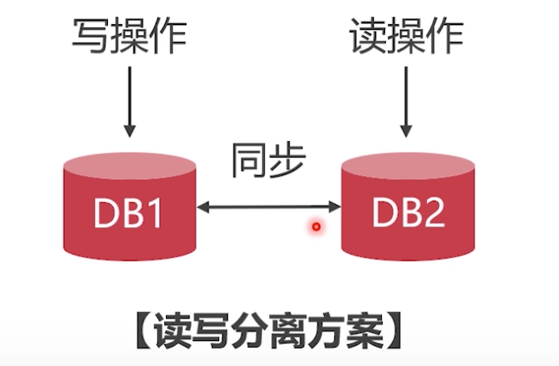
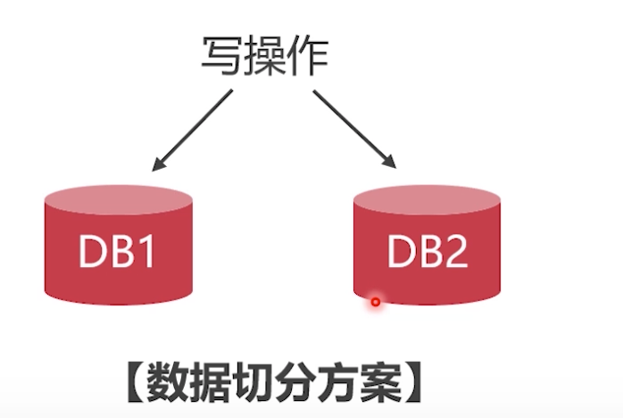
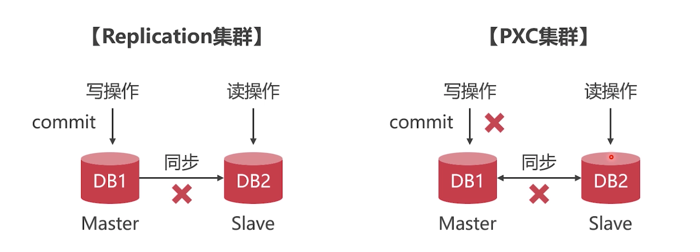

# 数据库集群能解决什么问题

## 单节点数据库和集群哪个读写更快

1、`低并发`的情况下, 单节点的MySQL读写速度更快

2、`高并发`的情况下，MySQL集群的读写速度更快

PS: MySQL最大连接数在1.6W左右

## MySQL集群方案

### 读写分离方案

要保证两个节点数据同步

### 数据切分方案

注意: db1和db2不能有数据同步

## 单节点数据库的弊病

- 大型互联网程序用户庞大，所有架构必须要特殊设计
- 单节点的数据库无法满足性能上的要求(MySQL最大连接数大约在1.6W)
- 单节点的数据库没有冗余设计，无法满足`高可用`

## 高并发下的数据库压力

2016年除夕，微信共收发红包`142亿`个,比上一年增长75.7%，最高峰值没秒收发红包达到`76万`个，银行卡支付峰值`20.8万`次/秒，创下世界记录。

## 常见企业级MySQL集群方案

- 常见MySQL集群方案有PXC(同步传输)和Replication(异步传输)
- 以上两种集群方案有各自的特点，PXC集群适合保存少量高价值数据，Replication 集群适合保存低价值大量数据

### PXC集群和Replication集群方案的对比

- Replication在一个节点写入了就算成功，如果两个节点之间网络断开，数据在DB1中写入成功并提交事物，无法在DB2中读取到该数据 - 适合评论、留言等不重要数据。
- PXC需要保证其他节点同步后才能写入成功，如果DB1写成功，DB2同步失败，无法提交事物，数据写入数独不如Replication集群 - 避免了数据读写不一致，是的订单等少量重要数据。

